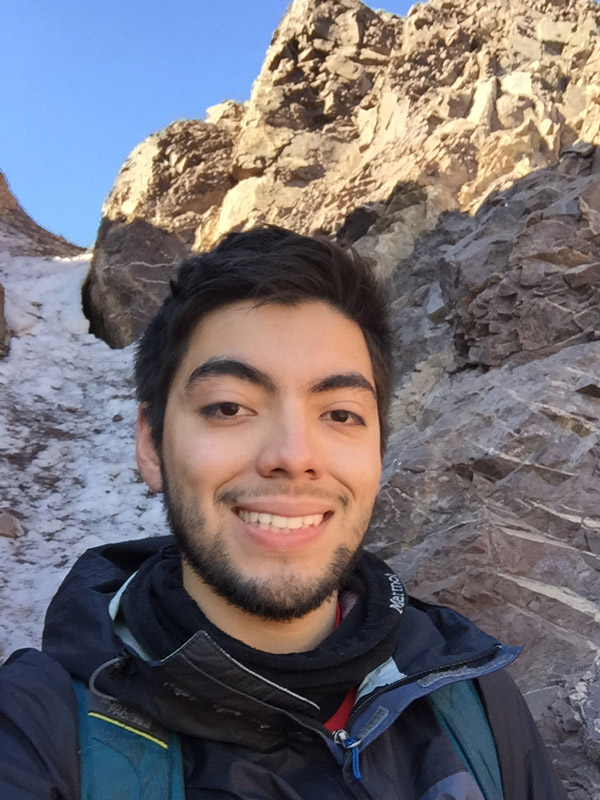

# #about

{: .right_img}

I'm an artist, coder, and physicist who love to understand how things work and deeply study about lots of fields, because I think that's the only way to create new solutions and contribute to the progress of humanity.

I like making things with electronics, cameras and cutting-edge technology. Mixing arts and science is one of my goals. Every day I learn something new.

Download my CV here
